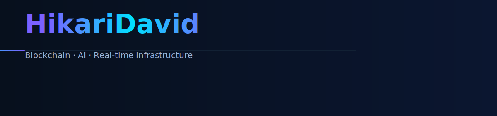

 
  
  
  

# Hi — I'm David (HikariDavid)

I build production-grade infrastructure where AI agents, APIs, and blockchains meet. Fast. Secure. Auditable.

---

## What I build (high-level)
- Parametric insurance systems that auto-settle claims on-chain
- Multi-chain payment gateways for monetizing APIs (x402 style)
- Autonomous market oracles and real-time intelligence for agents
- AI-driven matching systems focused on deep compatibility
- Scalable real-time data platforms (WebSocket + low-latency pipelines)

## Tech highlights
- Languages: TypeScript, Solidity, Python, JavaScript, SQL
- Frontend: Next.js, React, Tailwind
- Backend: Node.js, PostgreSQL, Drizzle ORM, Docker
- Blockchain: Foundry, Ethers.js, Base & Solana deployment
- Testing: Unit, E2E, Fuzz, Invariant suites

## Philosophy
Type safety, security-first, real-time-first. I design systems that assume they will handle real value and high load.

## Want the visual assets?
All SVG assets are in `/assets` (hero + animated skill bars) — tweak them as you like.

---

### Let's connect
- GitHub: https://github.com/HikariDavid
- Email: (add your email to README if you'd like)

> Backup: previous versions are in this repo's git history if you want them preserved.
