<picture>
  <!-- Preferred: webm video (if available) -->
  <source srcset="./assets/terminal-typing.webm" type="video/webm">
  <!-- Fallback GIF (if webm not supported) -->
  <source srcset="./assets/terminal-typing.gif" type="image/gif">
  <!-- Final fallback: inline animated SVG (supported by GitHub), or static PNG if SVG animations are blocked -->
  
</picture>

<p align="left">
  
  
  
  
  
</p>

# hi — i'm david (aka hikari)

I build production-grade infrastructure where autonomous agents pay for APIs and systems settle on-chain. This profile blends a terminal/hacker aesthetic with structured, depth-first technical writeups. Everything is still readable — just the right amount of geek.

---

## tl;dr

> I design and ship infrastructure at the intersection of Blockchain · AI · Real-time systems. Fast, auditable, and built for production.

- Primary focus: TypeScript + Solidity + Python
- Patterns: Reverse-proxy monetization (x402), parametric insurance, agent oracles, WebSocket streaming
- Security posture: audits, slither/mythril integration, semgrep CI

---

## quick stack

```bash
# my concise stack
const stack = "TypeScript · Solidity · Python · Node · Postgres"
```

---

## deep dives (pick one to expand)

<details>
<summary>Parametric Insurance Protocol — quick view</summary>

Problem

- AI agents call third-party APIs to complete tasks. When provider output deviates from benchmark, buyers lose value and trust.

Solution

- Real-time deviation monitoring against benchmark feeds (Pyth/CoinGecko), parametric rules & thresholds, and on-chain settlement if deviation > threshold.

Architecture (ASCII flow)

```
Agent ---> Gateway (x402) ---> Provider API
   |             |
   |             v
   |         Quote Service (risk engine)
   |             |
   v             v
Policy Store <-- Keeper (proactive + reactive scans)
   |
   +--> Settlement (on-chain Recourse.sol)
```

Key tech

- Contracts: Solidity + Foundry
- API / Risk engine: TypeScript
- Oracles: Pyth Hermes + CoinGecko (fallback)
- DB: Postgres + Drizzle

Security & tests

- Foundry tests: 37 unit tests + 4 invariants (41 total)
- Contract coverage: 100% lines, ~97% branches
- Invariant handler: 50K+ calls in CI runs
- Semgrep/Slither/Mythril gates in CI

Metrics / impact

- Live Base Sepolia proofs executed for ClaimSettled in test history
- Protects agent payments across multi-chain endpoints

</details>

<details>
<summary>X402 Payment Gateway — quick view</summary>

Problem

- Monetizing APIs requires complex billing + trust; developers want a simple, composable pricing primitive.

Solution

- Reverse proxy that enforces on-chain payment: request gets forwarded only after x402-style payment finalization.

Architecture (ASCII flow)

```
Client ---> x402 Gateway ---> Provider Endpoint
           |                 /
           | verify payment  /
           +---> Chain (settlement proof)
```

Key tech

- Gateway: TypeScript (fast proxy)
- Settlement: Web3/Ethers + Foundry-deployed contracts
- Multi-chain: Base + Solana accounted

Security & tests

- Unit + E2E tests covering happy + failure paths
- CI enforces payment-verification smoke tests

Impact

- One-line developer monetization: embed gateway, accept on-chain micropayments, forward request.

</details>

<details>
<summary>Autonomous Market Oracle — quick view</summary>

Problem

- Prediction markets often require manual market creation and resolution.

Solution

- Agents discover trending topics, create YES/NO markets, and auto-resolve using deterministic rules and oracle feeds.

Architecture

```
Data Harvesters => Agent Engine => Market Factory (on-chain)
                    |                    |
                    +--> Auto-resolve <---+
```

Tech

- Agents: Python orchestration
- Contracts: Solidity market mechanics
- Streaming: WebSockets for feed + real-time triggers

Impact

- Fully autonomous market lifecycle; zero human intervention for discovery + settlement.

</details>

<details>
<summary>Real-time Intelligence Stream</summary>

Problem

- Latency kills alpha. Agents need instant market intelligence.

Solution

- Low-latency WebSocket streams, native multi-chain payment integration, and stream-first APIs.

Architecture

```
Market Feeds -> Collector -> Stream Processor -> WebSocket Hub -> Agents
```

Tech

- Collector: Python w/ async IO
- Stream API: TypeScript, Redis pub/sub for fan-out
- Payments: Ethers.js integration

</details>

<details>
<summary>AI Personality Matching Engine</summary>

Problem

- Surface-level matching results in low-quality connections.

Solution

- Semantic fingerprinting ("soul prints"), compatibility scoring, conversation starter generation.

Tech

- Matching engine: TypeScript + semantic embeddings
- Frontend: React (privacy-first UI)

Impact

- Matches that explain *why* two users clicked — higher retention.

</details>

<details>
<summary>Urban Traffic Intelligence</summary>

Problem

- High-volume geolocation streams are noisy and expensive to process in real time.

Solution

- Streamable geolocation collector, predictive congestion model, and live routing recommendations.

Tech

- Ingest: WebSocket + batching
- Storage: Postgres spatial queries
- Analytics: real-time aggregations + ML models

</details>

---

## tech at a glance

```
Languages: TypeScript (95%), Solidity (75%), Python (70%), JS (60%), SQL (50%)
Frontend: Next.js, React, Tailwind
Backend: Node.js, Postgres, Drizzle ORM
Blockchain: Foundry, Ethers.js, Base & Solana
Testing: Unit, E2E, Fuzz, Invariants
```



---

## quickstart (copy/paste)

```bash
corepack pnpm install --frozen-lockfile
corepack pnpm -w typecheck
corepack pnpm -w build
corepack pnpm -w test
```

Run contracts:

```bash
corepack pnpm --filter contracts build
corepack pnpm --filter contracts test
corepack pnpm --filter contracts coverage
```

Local E2E (API on port 8080):

```bash
$env:RECOURSE_API_URL="http://localhost:8080/api"
corepack pnpm e2e:payout
corepack pnpm e2e:negative
```

---

## playback compatibility & how to export webm/gif

GitHub renders animated SVGs inline, but some platforms and previewers prefer webm/gif.

To export high-quality webm and a GIF fallback from the SVG locally, run (requires ffmpeg + librsvg):

```bash
# render SVG to PNG sequence (rsvg-convert or inkscape)
rsvg-convert -w 980 -h 260 assets/terminal-typing.svg -o /tmp/frame-%03d.png

# or with inkscape (single frame per second of animation isn't trivial)
# Use a headless renderer that can step through SVG animations, or use a browser-based capture.

# then assemble into webm
ffmpeg -framerate 30 -i /tmp/frame-%03d.png -c:v libvpx-vp9 -crf 30 -b:v 0 -pix_fmt yuva420p assets/terminal-typing.webm

# generate GIF (larger)
ffmpeg -f webm -i assets/terminal-typing.webm -vf "fps=20,scale=980:-1:flags=lanczos" -loop 0 assets/terminal-typing.gif
```

Note: Rendering animated SVG frames reliably often requires a headless browser capture (Puppeteer) to snapshot frames because many command-line SVG renderers don't evaluate SMIL/CSS animations.

Example using Puppeteer:

```js
// capture.js
const puppeteer = require('puppeteer');
(async () => {
  const browser = await puppeteer.launch();
  const page = await browser.newPage();
  await page.setContent(`<html><body>${require('fs').readFileSync('assets/terminal-typing.svg','utf8')}</body></html>`);
  await page.setViewport({ width: 980, height: 260 });
  for (let i = 0; i < 180; i++) {
    await page.screenshot({ path: `/tmp/frame-${String(i).padStart(3,'0')}.png` });
    await page.waitForTimeout(33);
  }
  await browser.close();
})();
```

Then assemble the PNGs into webm/gif as above.

---

## security & verification highlights

- Foundry: 37 unit tests + 4 invariant tests (handler reached 128k calls in runs)
- Contract coverage: 100% lines / ~97% branches
- CI Security: Semgrep, Slither, Mythril integrated in workflows
- Acceptance checklist: quickstart + E2E verified in CI

---

## by the numbers

```
- 12+ production projects
- 100% contract line coverage (current)
- 50K+ invariant handler calls (per suite)
- 24/7 real-time systems running
```

---

## repos (quick links)

- https://github.com/HikariDavid/Recourse — parametric insurance (detailed)
- https://github.com/HikariDavid/Vibe402Gateway — x402 payment gateway
- https://github.com/HikariDavid/PolyMind — real-time Polymarket intelligence
- https://github.com/HikariDavid/Prediction-market-Oracle — autonomous markets
- https://github.com/HikariDavid/jamify-kenya-traffic-app — traffic intelligence
- https://github.com/HikariDavid/SoulPrints — matching & personality engine

---

## contact & work

- GitHub: https://github.com/HikariDavid
- Email: add your email here if you want public contact
- Available for: infrastructure contracts, architecture reviews, security advisories

---

<footer>
  *This README blends terminal form with readable structure — expand the <details> blocks to see deep technical notes.*
</footer>
